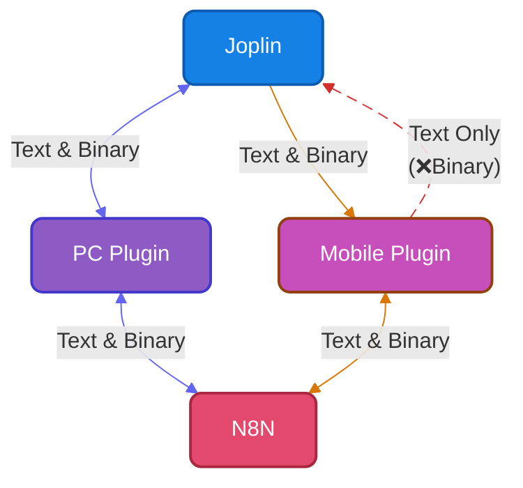

# Joplin to n8n (joplin2n8n)

Joplin의 노트 내용을 외부 자동화 툴인 N8N(또는 커스텀 서버) 웹훅으로 전송하고, 그 응답을 받아와 노트를 수정하거나 결과를 표시해주는 Joplin 플러그인입니다.

⚠️N8N[^1](혹은 커스텀 서버) 내에서의 워크플로우는 사용자가 직접 구성해야 합니다.

[^1]: `N8N`은 노드 기반의 워크플로우 자동화 플랫폼으로, 시각적인 드래그 앤 드롭 인터페이스를 사용하여 다양한 앱, 서비스 및 AI 모델을 연결하고 작업을 자동화할 수 있는 도구입니다.

## joplin2n8n 작동 흐름
현재 조플린 모바일 플러그인에서는 로컬 저장소 접근 제한으로 파일을 노트에 바로 삽입할 수 없습니다.
	


## 📱 지원 환경
- **PC** (Windows, Linux)
- **모바일** (Android)
- *macOS 및 iOS는 테스트 환경이 없어 작동을 100% 보장하지 못합니다.*

## 스크린샷


*joplin2n8n의 실행 과정*


*웹훅 설정 다이얼로그의 예시*


*웹훅 실행 다이얼로그의 예시*

---

## 📥 설치 방법

### 공식 설치 (플러그인 스토어)
1. Joplin 메뉴에서 `도구(Tools)` -> `설정(Options)` -> `플러그인(Plugins)`으로 이동합니다.
2. 검색창에 `joplin2n8n`을 검색합니다.
3. 설치 버튼을 누르고 Joplin을 재시작합니다.

### 수동 설치 (파일로 설치)
1. GitHub Releases 페이지에서 최신 `com.bonik.joplin2n8n.jpl` 파일을 다운로드합니다.
2. Joplin 메뉴에서 `도구(Tools)` -> `설정(Options)` -> `플러그인(Plugins)`으로 이동합니다.
3. 플러그인 관리 화면 상단의 `⚙️ (톱니바퀴)` 아이콘을 누르고 `파일에서 설치(Install from file)`를 선택합니다.
4. 다운로드한 `.jpl` 파일을 선택하고 Joplin을 재시작합니다.

---

## ⚙️ 웹훅 등록 및 설정
플러그인 설치 후 `도구(Tools)` -> `joplin2n8n 설정 변경` 메뉴를 클릭하여 N8N 웹훅을 등록합니다.
- **웹훅 제목**: 웹훅 제목을 입력합니다.
- **웹훅 URL**: 조플린이 요청을 보낼 N8N 웹훅 주소를 입력합니다.
- **인증 방식**: `없음`, `Basic Auth`, `Header Auth` 중 서버 구성에 맞게 선택합니다.

- **응답 처리**: 
  - `성공 여부만 표시`: 팝업으로 전송 성공/실패 여부만 띄웁니다.
  - `응답 TEXT/MD를 표시`: 응답받은 텍스트/마크다운을 보여주며, 필요시 기존 노트를 이 내용으로 교체할 수 있습니다.
  - `응답 HTML을 표시`: 응답받은 HTML을 팝업 화면에 렌더링해서 보여줍니다.
  - `파일을 노트에 삽입`: 응답으로 받은 파일을 노트에 삽입합니다. 모바일에서는 코어의 제약으로인해 지원하지 않으므로 외부에 업로드 후 링크를 받는 방식으로 우회해야 합니다.

- **마크다운 첨부파일 처리**: 
  - `링크 유지`: 조플린 노트의 마크다운 링크 구조를 유지 합니다. ``
  - `파일명을 치환`: 조플린 노트의 마크다운 링크를 실제 파일명으로 치환합니다. ``

---

## 🛠️ 플러그인 옵션
Joplin의 기본 설정 창 (`도구` -> `설정` -> `joplin2n8n`)에서 세부 옵션을 조절할 수 있습니다.


- joplin2n8n의 플러그인 옵션입니다. 
  웹훅 설정 다이얼로그 열기, UI 설정, 동작 설정, Payload에 담길 조플린 환경(기기명, 프로필명) 설정이 가능합니다.

---

## 🚀 전송 요청 방법
단축키를 할당 후 입력하거나 비행기 아이콘(➤)을 눌러 전송을 실행할 수 있습니다.

### PC 환경
- 전송할 노트를 선택(영역 선택시 해당 영역만 전송, 미선택시 노트 전체 전송)
- 상단 **도구(Tools)** 메뉴에서 전송할 웹훅 선택
- 노트 목록에서 **우클릭** 후 컨텍스트 메뉴에서 전송
- 노트 에디터 우측 상단의 **비행기 아이콘(➤)** 클릭
- 노트 에디터 툴의 **비행기 아이콘(➤)** 클릭 

### 모바일 환경
- 전송할 노트를 선택(영역 선택시 해당 영역만 전송, 미선택시 노트 전체 전송)
- 우측 상단 **도구(···)** 메뉴를 열고 등록한 웹훅 이름을 클릭
- 노트 에디터 하단의 툴에서 **비행기 툴바 아이콘(➤)** 클릭

---

## 🔧 N8N 워크플로우 설정

N8N 워크플로우는 사용자의 상황과 목적에 맞게 직접 구성하셔야 합니다.
*(반드시 N8N을 사용할 필요는 없으며, Python FastAPI나 Node.js Fastify 등을 이용해 커스텀 서버를 직접 구축하여 사용해도 완벽하게 호환됩니다.)*

**기본 워크플로우 구조:**
`Webhook 노드` ➔ `필요한 처리 노드(AI, API 등)` ➔ `Respond to Webhook 노드`


---

## 💡 joplin2n8n 활용 예시
이 플러그인을 활용하여 나만의 자동화 시스템을 구축해 보세요!

- 📧 **메일 전송**: 작성한 노트를 즉시 이메일로 발송
- 💬 **메신저 알림**: 슬랙, 텔레그램, 디스코드 등으로 전송
- 📝 **발행 시스템**: 워드프레스 블로그, 노션(Notion) 등으로 포스팅 발행
- 🔄 **파일 변환**: `.md` 문서를 `.pdf`, `html`, `json`, `xlsx` 등으로 변환하여 리턴
- ☁️ **클라우드 백업**: 특정 노트를 Google Drive나 외부 저장소에 백업
- 🤖 **AI 파이프라인**: 
  - 맞춤법 교정 및 요약
  - 번역본 자동 작성
  - 노트 내용과 관련된 외부 자료 조사 리포트 생성
  - 텍스트 기반 그래픽 이미지 생성 또는 음악 생성
- 📊 **RAG (검색 증강 생성)**: 노트 데이터를 임베딩(Embedding)하여 벡터 DB에 저장

## 예시를 보여주는 animated GIF

*AI를 이용한 텍스트 생성 예시*
  

*AI를 이용한 번역 예시*


*Javascript 코드를 이용해 마크다운 테이블을 Json으로 변환하는 예시*


*Exiftool을 이용해  이미지 파일의 정보를 알아내는 예시*


*AI를 이용해  이미지 내의 표를 마크다운 표로 변환하는 예시*


*Javascript 코드를 이용해 마크다운 형식의 이미지 코드를 HTML 형식의 이미지 코드로 변환하는 예시(손쉽게 너비 조절 및 가운데 정렬 가능)*


*joplin2n8n을 활용한 마크다운 이미지 변환 예시*

---

## 팁 (Tips)
### 응답(Response) 옵션 선택 가이드
- **성공 여부만 표시**: 백그라운드로 처리되는 작업(메일 전송, 백업 등)의 성공/실패 여부만 확인할 때 유용합니다.
- **응답 TEXT/MD를 표시**: AI 교정이나 번역 등, **마크다운 노트 본문을 변경(교체)**하는 작업에 사용하세요.
- **응답 HTML을 표시**: 차트, 대시보드, 복잡한 웹 레이아웃 등 화려한 결과물을 팝업으로 렌더링해서 확인하고 싶을 때 사용합니다. (Joplin 샌드박스 정책상 외부 스크립트 실행 등에 제약이 있을 수 있습니다.)
- **파일을 노트에 삽입**:  응답으로 받은 파일을 노트에 바로 삽입하거나 보낸 파일을 새 파일로 교체할 때 사용합니다. 파일 변환, Text to Image 등에 사용할 수 있습니다.

### 모바일에서 바이너리 받기
모바일에서 조플린 플러그인은 로컬 저장소 접근 권한이 없기 때문에 다음과 같은 방식으로 우회할 수 있습니다.
- N8N에서 바이너리 작성
- 외부 업로드 후 링크를 응답으로 표시
- 조플린에서 응답 내의 URL을 클릭(복사가 실행됩니다.)
- 모바일 브라우저에서 링크를 붙여넣고 다운로드
- 노트에 삽입

### N8N 쿼리(Query)를 이용해 단일 웹훅으로 다중 라우팅하기
웹훅 개수를 무한정 늘리는 대신, URL 파라미터를 활용하고 n8n 내부에서 **Switch 노드**로 분기하면 URL 1개로 다양한 자동화를 처리할 수 있습니다.

```text
https://n8n.example.com/webhook/j2n_ai?act=generate
https://n8n.example.com/webhook/j2n_ai?act=search
https://n8n.example.com/webhook/j2n_ai?act=summary
https://n8n.example.com/webhook/j2n_ai?act=translate
```

---

## 제작 정보
- **라이선스 (License)**: MIT License
- **제작자**: BoniK ([mail@bonik.me](mailto:mail@bonik.me) / [https://bonik.me](https://bonik.me))
- **후원하기**: [Buy me a coffee](https://buymeacoffee.com/bonik)
