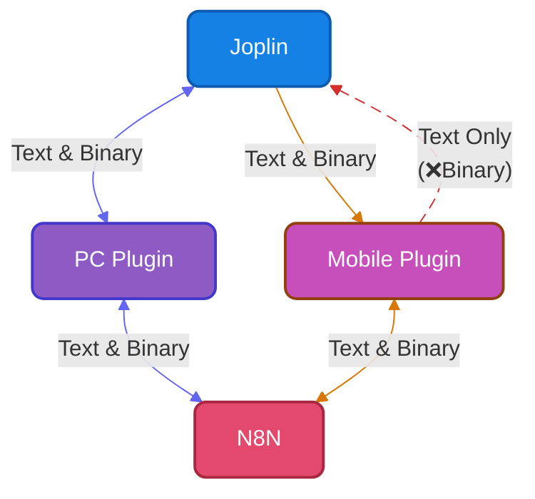

[English](README.md) | [한국어](README-ko.md)

# Joplin to n8n (joplin2n8n)

A Joplin plugin that sends note content to a webhook on n8n (or a custom server), receives the response, and either updates the note or displays the result.

⚠️ The workflow inside n8n[^1] (or your custom server) must be configured by the user.

[^1]: `n8n` is a node-based workflow automation platform that lets you visually connect apps, services, and AI models using a drag-and-drop interface to automate tasks.

## How joplin2n8n Works

> ℹ️ Due to local storage access restrictions in the Joplin mobile plugin, files cannot be inserted directly into notes on mobile.



## 📱 Supported Platforms
- **PC** (Windows, Linux)
- **Mobile** (Android)
- *macOS and iOS are not fully guaranteed — no test environment is available.*

## 📸 Screenshots


*joplin2n8n execution flow*


*Webhook settings dialog*


*Webhook send dialog*

---

## 📥 Installation

### From the Plugin Store (Recommended)
1. In Joplin, go to `Tools` → `Options` → `Plugins`.
2. Search for `joplin2n8n`.
3. Click **Install** and restart Joplin.

### Manual Installation (from file)
1. Download the latest `com.bonik.joplin2n8n.jpl` from the GitHub Releases page.
2. In Joplin, go to `Tools` → `Options` → `Plugins`.
3. Click the `⚙️` (gear) icon at the top of the plugin management screen and select `Install from file`.
4. Select the downloaded `.jpl` file and restart Joplin.

---

## ⚙️ Webhook Registration & Settings
After installation, click `Tools` → `Change joplin2n8n Settings` to register your n8n webhook.

- **Webhook Title**: Enter a name for the webhook.
- **Webhook URL**: Enter the n8n webhook URL that Joplin will send requests to.
- **Authentication**: Choose from `None`, `Basic Auth`, or `Header Auth` depending on your server configuration.

- **Response Handling**:
  - `Show success/failure only`: Displays a popup indicating whether the request succeeded or failed.
  - `Show response TEXT/MD`: Displays the response text or Markdown, with an option to replace the current note content.
  - `Show response HTML`: Renders the response HTML in a popup window.
  - `Insert file into note`: Inserts the received file directly into the note. Not supported on mobile due to core restrictions — use the workaround of uploading to an external server and receiving a link instead.

- **Markdown Attachment Links**:
  - `Keep links`: Preserves the Joplin note's Markdown link structure. ``
  - `Replace with filename`: Replaces Joplin Markdown links with the actual filename. ``


---

## 🛠️ Plugin Options
Fine-tune behavior from Joplin's settings panel (`Tools` → `Options` → `joplin2n8n`).


*Configure the webhook settings dialog, UI preferences, behavior options, and the Joplin environment info (device name, profile name) included in the payload.*

---

## 🚀 How to Send a Request
Assign a keyboard shortcut or click the send icon (➤) to trigger a request.

### PC
- Select text in the editor to send only the selection; if nothing is selected, the entire note is sent.
- Choose a webhook from the **Tools** menu at the top.
- **Right-click** a note in the note list and select from the context menu.
- Click the **send icon (➤)** in the top-right corner of the note editor.
- Click the **send icon (➤)** in the note editor toolbar.

### Mobile
- Select text in the editor to send only the selection; if nothing is selected, the entire note is sent.
- Open the **Tools (···)** menu in the top-right corner and tap the registered webhook name.
- Tap the **send toolbar icon (➤)** at the bottom of the note editor.

---

## 🔧 n8n Workflow Setup

The n8n workflow must be configured according to your own needs and use case.
*(n8n is not required — a custom server built with Python FastAPI, Node.js Fastify, or similar will work just as well.)*

**Basic workflow structure:**
`Webhook node` ➔ `Processing nodes (AI, API, etc.)` ➔ `Respond to Webhook node`


---

## 💡 Use Cases
Build your own automation system with joplin2n8n!

- 📧 **Email**: Send a note as an email instantly.
- 💬 **Messenger Notifications**: Forward to Slack, Telegram, Discord, and more.
- 📝 **Publishing**: Post to WordPress, Notion, or other platforms.
- 🔄 **File Conversion**: Convert `.md` to `.pdf`, `html`, `json`, `xlsx`, and get it back in the note.
- ☁️ **Cloud Backup**: Back up specific notes to Google Drive or other external storage.
- 🤖 **AI Pipelines**:
  - Spelling correction and summarization
  - Automatic translation
  - Research report generation based on note content
  - Text-to-image or text-to-music generation
- 📊 **RAG (Retrieval-Augmented Generation)**: Embed note data and store it in a vector database.

## 🎬 Demo GIFs


*AI-powered text generation*


*AI-powered translation*


*Converting a Markdown table to JSON using JavaScript code*


*Extracting image metadata using Exiftool*


*Converting a table inside an image to a Markdown table using AI*


*Converting Markdown image syntax to HTML image tags using JavaScript (easy width control and center alignment)*


*Resizing and converting image format (extension) using ImageMagick*

---

## 💡 Tips
### Response Option Guide
- **Show success/failure only**: Useful for background tasks (email sending, backup, etc.) where you only need to confirm the result.
- **Show response TEXT/MD**: Use this for AI corrections, translations, or any task that **replaces the Markdown note body**.
- **Show response HTML**: Use this when you want to render rich outputs — charts, dashboards, complex layouts — in a popup. (Note: Joplin's sandbox policy may restrict external script execution.)
- **Insert file into note**: Use this when you want to insert a received file directly into the note or replace a sent file with a new one. Useful for file conversion, Text to Image, and similar workflows.

### Receiving Binary Files on Mobile
The Joplin mobile plugin has no access to local storage. Use the following workaround:
1. Generate the file (binary) in n8n and upload it to an external server.
2. Return the uploaded file's link as the response.
3. Tap the URL in Joplin's response (it is automatically copied to the clipboard).
4. Paste the link into a mobile browser and download the file.
5. Insert the downloaded file into the note.

### Multi-Routing with a Single Webhook Using n8n Query Parameters
Instead of creating a large number of webhooks, use URL query parameters and route them with a **Switch node** inside n8n — one URL handles multiple automations.

```text
https://n8n.example.com/webhook/j2n_ai?act=generate
https://n8n.example.com/webhook/j2n_ai?act=search
https://n8n.example.com/webhook/j2n_ai?act=summary
https://n8n.example.com/webhook/j2n_ai?act=translate
```

---

## About
- **License**: MIT License
- **Author**: BoniK ([mail@bonik.me](mailto:mail@bonik.me) / [https://bonik.me](https://bonik.me))
- **Support**: [Buy me a coffee](https://buymeacoffee.com/bonik)
